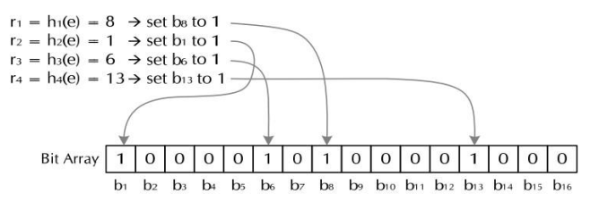

### 1 布隆过滤
#### 1.1 概序
 - 布隆过滤（Bloom filtering）是一种二进制向量数据结构，被用来检测一个元素是不是一个集合S中的成员。
 - 如果一个元素在集合S中，那么它肯定能通过布隆过滤器，即能够被判断正确识别；如果一个元素不在几个S中，那么它也存在一定的概率能通过布隆过滤器，即存在一定的概率被误判。布隆过滤器对集合S中的元素的召回率是100%的。
 - 布隆过滤的目的不是100%正确判断，而是让所有在S中的元素通过，而阻挡大部分键值不在S中的元素。它是一种以正确率换空间的数据结构（对比hash表是一种以空间换时间的数据结构）。
 - 布隆过滤是一种大数据算法，其集合通常是大到无法再内存中存放，如10亿有电子邮件（10亿\*20B=20GB）、50亿个电话号码（50亿\*11B=55GB）。使用布隆过滤的位数组时，1GB就有80亿个位，可以映射更大的数据量。

#### 1.2 实现
一个布隆过滤器由如下几部分组成：
 - n个**位**组成的数组，每个位初始值都为0。（位数组）
 - m个键-值组成的集合S。
 - 一系列hash函数h1,h2,...,hk组成的集合，每个hash函数将S中的键映射到位数组的n个位中，映射到的位置设置为1。 

当一个键值为K的元素到来时，检查所有的h1(K),h2(K),...,hk(K)对应的位是否全部为1，如果是，则允许该元素通过，即认为该元素属于S，如果有一位或多位为0，则认为K不可能在S中，于是拒绝该元素通过，即认为该元素不属于S。 

#### 1.3 优缺点
- 优点
  1. 时间与空间：插入时间和查询时间复杂度都是O(1)；节省了内存空间。
  2. 多个hash函数可以并行计算。
  3. 可以使用位运算进行加速。
- 缺点
  1. 错误率随着数组的负债率上升而上升。
  2. 不能删除元素。
  3. 可能将不再集合中的元素判定为在集合中（假阳率（false positive））

#### 1.4 错误率分析
设位数组的长度为n、集合S的元素个数为m、hash函数的数目为k，则假阳率可以表示为：（1-e-km/n）k

