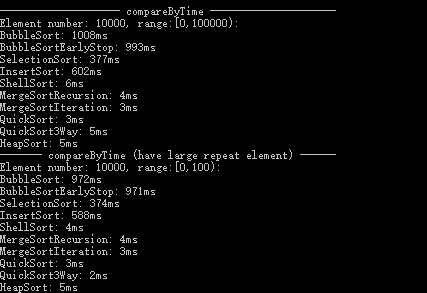

## 排序
### 0 写在前面：什么时候不需要排序
有时候我们会对数据进行排序，从而方便取数据。然而对于直接取数据这类问题，最佳选择应该是**hash**，如果使用好的hash函数（能较好解决冲突），能够做到在常数时间（取决于哈希函数、负载因子（元素数量/桶的数量））取得数据，这远远要好于二分查找的logN时间复杂度。 当然如果你想找的是最大值、最小值、Top N，那hash就无能为力了。

### 1 内部排序算法
#### 1.1 冒泡排序
 - 概述：使用一种“冒泡策略”把最大元素移到序列最右端。在一次冒泡过程中，相邻的元素比较。如果左边的元素大于右边的元素，则交换。
 - 提前终止：一趟冒泡过程中，如果没有元素交换位置，则算法终止。
 - code：[冒泡排序](./bubbleSort.h) &ensp; [提前终止的冒泡排序](./bubbleSort.h)

#### 1.2 选择排序
 - 概述：首先，找到数组中最小的那个元素，然后将它和数组的第一个元素交换位置（如果第一个元素就是最小元素，那么它就和自己交换）。再次，在剩下的元素中找到最小的元素，将它和数组的第二个元素交换位置。如此反复，直到整个数组排序。
 - 特点：
   1. 对于长度为N的数组，选择排序需要进行N2/2次比较和N次交换。
   2. 运行时间与输入数据的分布无关，即一个原本有序数组或者主键全部相同的数组和一个元素排列的数组所用的排序时间是一样的。
   3. 只进行了N次交换，在所有的排序算法中，交换次数是最少的。
 - code：[选择排序](./selectionSort.h)

#### 1.3 插入排序
 - 概述：从左到右对每一个元素执行插入操作。在第i步插入中，将当前元素插入到前i-1个元素中的适合位置，并将插入位置之后的所有元素右移一位。
 - 特点：
   1. 插入排序所需的时间取决于输入中元素的初始顺序，当初始顺序已经为有序时，插入排序的的时间复杂度为O(N)
   2. **当排序数据比较少时，插入排序比其它排序算法都要快。**比如：5 ~ 15
 - code：[插入排序](./insertSort.h)

#### 1.4 希尔排序
 - 概述：希尔排序是插入排序的一种改进，每次交换不相邻的元素以对数组的局部进行排序，并最终用插入排序将局部有些的数组排序
 - code：[希尔排序](./shellSort.h)

#### 1.5 归并排序
 - 概述：
   1. 自顶向下的归并排序：递归。先将数组分成两半分别排序，然后将结果归并起来。
   2. 自底向上的归并排序：迭代。对所有元素先进行两两归并，然后是四四归并，然后八八归并，一直下去。在每一轮归并中，最后一次归并的第二个子数组可能比第一个子数组要小，如果不是的话所有的归并中两个数组大小都应该一样，而在下一轮中子数组的大小会翻倍。
 - 优化：
   1. 使用插入排序处理小规模的子数组，一般可以将归并排序的运行时间缩短10%~15%
   2. 在使用辅助数组b的时候，不进行每一轮都借助b来归并然后拷贝会a，而是轮流地将元素从a归并到b，从b归并到a，从而减少从b到a的拷贝过程。
 - code：[归并排序(递归版本)](./mergeSortRecursion.h) &ensp; [归并排序(迭代版本)](./mergeSortIteration.h)

#### 1.6 快速排序
 - 概述：快速排序把n个元素划分为3段：左段left、中段middle、右段right。其中：中段只有一个元素，左段元素都不大于中段元素，右端元素都不小于中段元素。可以分别递归地对左段和右端进行排序且不用归并，当左段和右端都有序时，整个数组就都有序了。
 - 特点：
  1. **快速排序是最快的通用排序算法**。它之所以快是因为它的内循环中指令很少（而且它还能利用缓存，因为它总是顺序地访问数据），它的运行时间的增长数量级为~cNlogN，而这里的c比其他线性对数级别的排序算法的相应常数都要小。
  2. 非递归版本的快速排序中，自己手动创建一个栈来存储每次分块快排的起始点。
     - 理论上说，使用非递归算法的效率都要比递归算法的效率高，因为递归算法使用使用一个递归栈保存函数调用时的参数、局部变量、返回值等信息（即存在函数调用开销），如果这部分开销很大，则递归栈会很大，效率自然就会下降。
     - 后面测试会发现，**非递归版本的快速排序比递归版本的快速排序要慢**。可以原因是，递归的快速排序局部变量只有mid，非常少；递归版本的使用率进程的递归栈，而非递归版本使用了C++ STL的stack数据结构，两者之间效率存在一定差距。
  3. 在使用三向切分之后，快速排序对于有大量重复元素的排序任务时间复杂度可能降到线性级别，而其他算法则仍然需要线性对数时间。
 - 优化：
    1. 使用插入排序处理小规模的子数组
    2. 在实际的应用中经常会出现含有大量重复元素的数组，这时使用三向切分快速排序，可以使线性对数级别的性能提高到线性级别
    3. 当输入数据基本有序时，快速排序的的时间复杂度达到最差情况，接近N2，可以通过对输入元素乱序，使得输入数据不会基本有序。
 - code：[快速排序](./quickSort.h) &ensp; [快速排序非递归版本](./quickSortByStack.h) &ensp; [三向切分快速排序](./quickSort3Way.h) &ensp; [快速排序(链表)](./quickSortList.cpp)

#### 1.7 堆排序
 - 概述：堆排序分为两个阶段：堆的构造阶段 和 下沉排序阶段。
   1. 在堆的构造阶段，将原始数组重新组织成大顶堆。
   2. 在下沉排序阶段，不断将堆顶元素（最大元素）和堆的最后一个元素交换位置，并让堆的大小减1；如此反复，数组将变得有序（从小到大）。
 - 优化：
   1. **堆排序是唯一能够同时最优利用空间和时间的方法——在最坏的情况下它也能保证使用~2NlogN次比较和恒定的额外空间，当空间十分紧张时它很流行。**
   2. 然而堆排序无法利用缓存，数组元素很少和相邻的其它元素进行比较，因此缓存命中率远远低于大多数比较都在相邻元素间的算法，如快速排序、归并排序，甚至希尔排序。
 - code：[堆排序](./heapSort.h)

#### 1.8 箱子排序
 - 概述：给定一个长度为N的待排序数组，首先将这个长度N的数组划分为M个子区间（桶），然后基于某种映射函数，将待排序数组的关键字k映射到第i个桶中(B[i])，那么该关键字k就作为B[i]中的元素。接着对每个桶B[i]中的所有元素进行比较排序（如使用插入排序）。最后从最后一个桶开始到第一个桶，输出桶中元素，即可得到有序的数组。
   1. 箱子排序的关键就在于映射函数，它必须满足：k1<k2，则f(k1)<f(k2)
 - 特点：
   1. 在箱子排序中，使用链表比使用数组效率高。对于每个桶，使用一个bottom指针指向桶底，top指针指向桶顶，每次向桶中增加元素都是在桶顶插入元素，时间复杂度为O(1)；最后收集时，只需要将前一个桶的桶顶元素的next指针指向下一个非空桶的桶底元素即可，时间复杂度为O(M)。
   2. 箱子排序的时间复杂度为线性的O(N+C)，其中C=N*(logN - logM)。对于同样的N，桶的数量M越大，其效率越高，最好的时间复杂度达到O(N)。然而箱子排序的空间复杂度为O(N+M)，如果输入数据范围非常庞大，那空间代价将非常高。
   3. **在有大量重复元素时，且数据的范围不大时，箱子排序非常快**。
 - code：[箱子排序](./binSort.h)

#### 1.9 基数排序
 - 概述：将所有待排序数组的数值统一为同样的长度，数位短的前面补0。然后**从最低位开始**到最高位，依次进行一次**稳定排序**，最终数组将变得有序。
 - 两个问题：
   1. 为什么要从低位开始向高位排序？ 如果要从高位排序到低位，那么次高位的排序将会影响高位已经排序好的大小关系。从重要性最低的低位开始排序，最后排序重要性最高的，就是对这种影响的排序。
   2. 为什么同一个数位的排序子程序要使用稳定排序？ 稳定排序能保证上一次排序的成果被保留，十位数的排序过程能保留个位数的排序成果，百位数的排序过程能保留十位数的排序成果。
 - 特点：基数排序可以应用于多关键字排序
 - code：若以10为基数，从底位到高位分解为：x%10、(x%100)/10、(x%1000)/100、...  若以100为基数，从低位到高位分解为：x%100、(x%10000)/100、(x%1000000)/10000、...  若以r为基数，从低位到高位分解为：x%r、(x%r2)/r、  (x%r3)/r2、...

### 2 排序算法比较

类别|算法|是否稳定|是否原地排序|时间复杂度(平均)|时间复杂度(最好)|时间复杂度(最坏)|空间复杂度|备注
:---:|:---:|:---:|:---:|:---:|:---:|:---:|:---:|:---
插入排序|直接插入|是|是|N2|N|N2|1|取决输入元素的排列情况 当排序数据比较少时，插入排序比其它排序算法都要快。
插入排序|希尔排序|否|是|NlogN? N6/5?|NlogN? N6/5?|NlogN? N6/5?|1|后面更复杂的排序算法，速度都不会超过希尔排序的两倍
选择排序|直接选择|否|是|N2|N2|N2|1|在所有的排序算法中，交换次数是最少的。
选择排序|堆排序|否|是|NlogN|NlogN|NlogN|1|较好利用时间和空间，但无法利用缓存
交换排序|冒泡排序|是|是|N2|N|N2|1|
交换排序|快速排序|否|是|NlogN|NlogN|N2|logN|快速排序需要一个栈空间来实现递归，该递归栈的最大深度为logN
交换排序|三向快速排序|否|是|介于N和NlogN之间|N|N2|logN|当存在大量重复元素时，三向快速排序的时间复杂度接近于线性级别
归并排序|归并排序|是|否|NlogN|NlogN|NlogN|N|使用一个与原数组大小相等的辅助数组
分配排序|箱子排序|是|否|N+N*(logN-logM)|N||N+M|M是箱子（桶）的数量，M越大，效率就越高，但是代价是空间复杂度越大
分配排序|基数排序|是|否|d(N+rd)|d(N+rd)|d(N+rd)|rd|r是关键字的基数，d是长度

### 3 C++STL和Java Arrays.sort()
 - C\+\+ 
C\+\+ STL中使用了改变的快速排序，当排序算法的子序列数量超过对数logN的某个常数倍时，使用堆排序，在数据段不大时，使用插入排序。 
stable_sort函数使用归并排序，但是当数据段不大时，使用插入排序
 - Java 
 Java的Arrays.sort()对原始数据类型使用(三向切分的)快速排序，对引用类型使用归并排序。 
 对于引用类型，Java用速度和空间来换取稳定性。

###4 排序算法运行时间比较
[code:比较程序](compareSort.cpp) 

