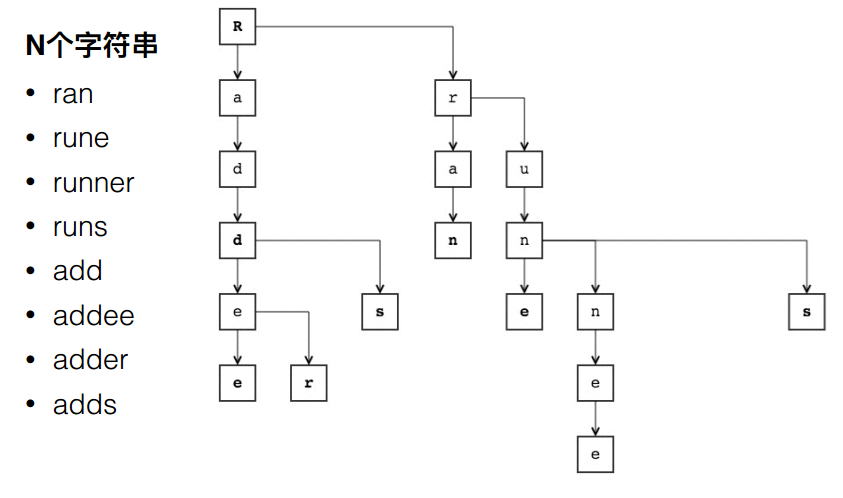

## 字典树
### 1 概述
字典树又称前缀树，是一种有序树，其中的key通常是字符或字符串。与搜索树不同，字典树的key不是直接保存在节点中，而是由节点在树中的位置决定的。一个节点的所有子孙都具有相同的前缀，也就是这个节点对应的字符串，而根节点对应空字符串。一般情况下，不是所有的节点都有对应的值，只有叶子节点和部分内部节点所对应的键才有相关的值。 如下是一棵字典树： 

### 2 实现
[字典树](./Trie.h)
 - void **insert**(string word)：向字典树中插入单词word
 - bool **search**(string word)：在字典树中查找单词word，当字典树中存在单词word时返回true
 - bool **startsWith**(string prefix)：判断字典树中是否存在以prefix开头的前缀
   
### 3 字典树的应用
搜索推荐：在搜索引擎中，搜索时自动联想的功能就是使用了字典树
